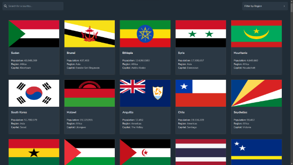

<h1  >Countries Api <h1>




### Website : https://countries-datax.netlify.app/ ###

## Features

 Users are able to: 
- See all countries from the API on the homepage.
- Search for a country using an `input` field.
- Filter countries by region.
- Click on a country to see more detailed information on a separate page.
- Click through to the border countries on the detail page.
- Toggle the color scheme between light and dark mode. 

## Built with

- [React](https://react.dev/) - A javaScript library that allows you to create user interfaces.
- [TypeScript](https://www.typescriptlang.org/) -  A strongly typed programming language that builds on JavaScript.
- [Tailwind-css](https://tailwindcss.com/) - A utility-first CSS framework.
- [React-Router](https://reactrouter.com/en/main) - A tool that allows you to create routes, navigation, and page-switching in your React web applications.
- [Valtio](https://valtio.pmnd.rs/) - A state-management library.
- [Vite](https://vitejs.dev/) - A tool that is used for building fast and optimized web applications. 
- [Cypress](https://www.cypress.io/) - With Cypress, you can easily create tests for your modern web applications and debug them visually. 


## Installation

- Clone the repository

```sh
git clone https://github.com/arr199/Countries-API
```

- Install dependencies

```sh
npm install
```

- Run server

```sh
 npm run dev
```

